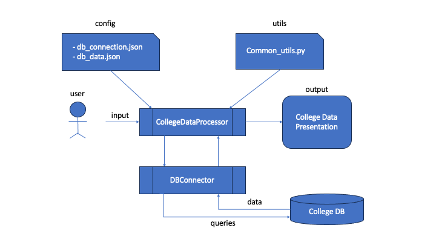

# Collage Resource Management
In this project we are connecting oracle db using python. We are performing CRUD operations on the data. We are initiallizing database with all the branches data which includes information on students, subjects and professors. 

## Project Architecture

## Environment setup
- Follow first 3 steps for Windows listed on this page - https://www.oracle.com/database/technologies/appdev/python/quickstartpythononprem.html
- Install git bash - https://gitforwindows.org/
- Install pip utility - https://www.geeksforgeeks.org/how-to-install-pip-on-windows/
- Install prettytable - pip install prettytable

Once oracle db is installed successfully follow these steps to create user. Try to use gitbash as much as possible.
1. Run this command - sqlplus sys as sysdba
2. Enter password which you had setup during Oracle installation.
3. Run following sql queries one by one in sqlplus.
    - alter session set container=xepdb1; 
    - create user pydbuser identified by oracle;
    - grant connect,resource,dba,create session,unlimited tablespace to pydbuser;
4. exit from sqlplus
5. login with - sqlplus pydbuser/oracle@localhost:1521/xepdb1

## Steps to clone Git repository
1. Follow these steps to generate ssh key for gitrepo
   - ssh-keygen -t ed25519 -C "yshardul@gmail.com". Keep on pressing "Enter" to use all default locations and file names.
   - eval "$(ssh-agent -s)"
   - ssh-add ~/.ssh/id_ed25519
2. Add ssh key in your git profile
   - Login to https://github.com using your creds.
   - Click on your profile icon and then Settings.
   - Click on "SSH and GPG keys" in the left side panel of options.
   - Click on "New Ssh Key".
   - Enter Title for your key and paste the previously copied key in "Key" section.
   - Click on "Add SSH key".
3. Run command - git clone git@github.com:yshardulgmail/python_oracle.git

## Steps to create new repo
1. On Github's home page, click on "New" to create new repo.
2. Enter repo name and make it public by selecting that option.
3. Use ssh URL to clone the repo.

   
4. Run Command - git clone <ssh_URL_Copied_in_step_above>
5. Once you have content in your repo run following commands in sequence -
   -  git add .
   -  git commit -a -v -m "<Some commit message>"
   -  git push origin main
     

## Run the project
1. Make sure your DB is running.
2. Enter your cloned project repo - cd <cloned_dir_path>/python_oracle
3. Run project using command - python college_data.py
